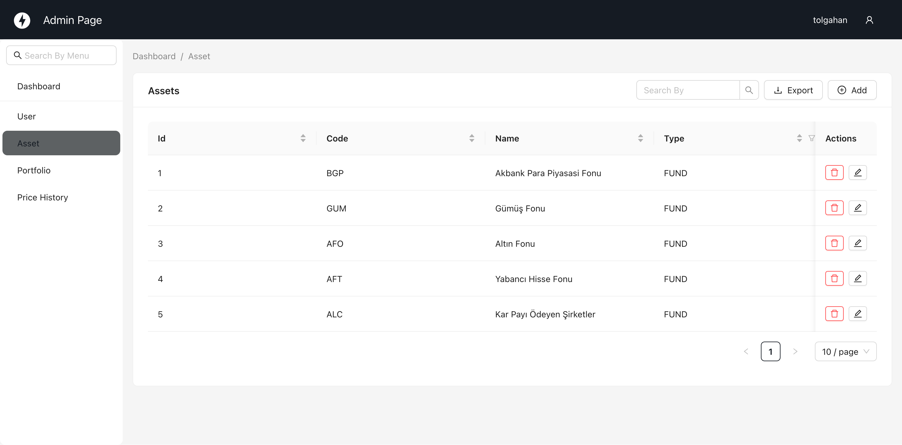

# MyVault - Investment Portfolio Tracker

A modern, lightweight web application for tracking your stock and fund investments.

[🇹🇷 Türkçe README](README_TR.md)

## Screenshots

| Dashboard (Dark Mode) | Admin Panel |
|:---:|:---:|
|  |  |

## Tech Stack

- **Backend:** Python, FastAPI, SQLAlchemy, SQLite, APScheduler
- **Admin Panel:** FastAdmin
- **Database Migration:** Alembic
- **Frontend:** HTML, CSS (Bootstrap 5), Vanilla JavaScript
- **Data Source:** TEFAS (via crawler)

## Key Features

- **Asset Management:** Manage funds/stocks via advanced FastAdmin panel.
- **Portfolio Tracking:** Track quantity, cost, and current value.
- **Modern Dashboard:** Responsive sidebar layout with Dark Mode support.
- **Automated Data:** Daily price updates from TEFAS background jobs.
- **Charts:** Historical price visualization with Chart.js.
- **Multi-language:** English and Turkish support (Frontend & Admin).
- **Security:** Secure JWT authentication for users & Admin panel protection.
- **Portfolio Isolation:** Users manage their own isolated portfolio data.

## Installation

1. **Clone & Setup:**
   ```bash
   git clone https://github.com/tolgahanuzun/MyVault
   cd MyVault
   python3 -m venv venv
   source venv/bin/activate
   pip install -r requirements.txt
   ```

2. **Database & User Setup:**
   ```bash
   # Create/Update database tables
   alembic upgrade head
   
   # Create admin user
   python script.py
   ```
   *Note: Default database is `local.db`. You can change it via `DATABASE_URL` in `.env` file.*

3. **Run:**
   ```bash
   uvicorn backend.main:app --reload
   ```

4. **Access:**
   - App: [http://127.0.0.1:8000](http://127.0.0.1:8000)
   - Admin: [http://127.0.0.1:8000/admin](http://127.0.0.1:8000/admin) (Login with created user)

## Todo List

- [x] Admin Panel Integration (FastAdmin)
- [x] Modern UI Overhaul (Sidebar & Dark Mode)
- [x] Database Migration System (Alembic)
- [x] Admin User Management & Security
- [x] End-User Authentication (JWT - Frontend)
- [x] Portfolio Data Isolation per User
- [ ] Mobile App (React Native/Flutter)
- [ ] Telegram Bot Notifications
- [ ] Foreign Stocks & Crypto Support
- [ ] Data Export (CSV/Excel)
